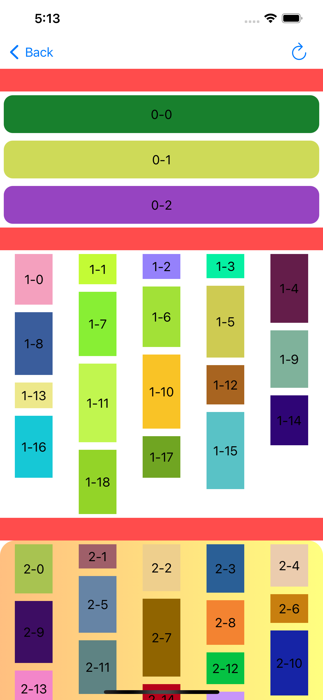

<h3 align = "center">瀑布流控件</h3>

* 1、**[介绍](#-----1-----)**
* 2、**[演示](#-----2-----)**
* 3、**[接入](#-----3-----)**
* 4、**[瀑布流背景](#-----4-----)**


<h3 id="-----1-----" align = "center">1、介绍</h3>

 * 瀑布流控件：
  *  1、支持多样式混排展示，部分section单列，部分section瀑布流
  *  2、接入简单，仅比原生UICollectionViewFlowLayout多一个方法调用
  *  3、支持section背景设置（效果：可设置渐变、圆角、阴影等，范围：可覆盖section下的item，也是可以包括头部）

<h3 id="-----2-----" align = "center">2、演示</h3>



<h3 id="-----3-----" align = "center">3、接入</h3>

由系统UICollectionViewFlowLayout改为接入ZCCollectionViewLayout非常简单，因为本身便是基于UICollectionView原生代理方法实现

* 1、引入pod

```ruby
pod 'ZCCollectionView'
```

* 2、修改Layout类为ZCCollectionViewLayout

```obj-c
//UICollectionViewFlowLayout *flowLayout = [[UICollectionViewFlowLayout alloc] init];
ZCCollectionViewLayout *flowLayout = [[ZCCollectionViewLayout alloc] init];
```

* 3、ZCCollectionViewLayout需要指定每个section的列数

```obj-c
flowLayout.getLineMaxCountForSection = ^NSUInteger(NSUInteger section) {
    return section == 0 ? 1 : 5;
};
```

总结：使用ZCCollectionViewLayout相比UICollectionViewFlowLayout，只需多调用用一个方法getLineMaxCountForSection

<h3 id="-----4-----" align = "center">4、瀑布流背景</h3>

如果需要设置section背景，只需实现以下方法

```obj-c
- (ZCCollectionBackStyle)collectionView:(UICollectionView *)collectionView setupBackgound:(ZCCollectionBackView *)backView forSection:(NSUInteger)section {
    if (section != 2) { // 针对不同section 设置不同的样式
        return ZCCollectionBackStyleNone;
    }
    
//    backView.layer.backgroundColor = [UIColor orangeColor].CGColor;
    backView.layer.startPoint = CGPointMake(0, 0.5);
    backView.layer.endPoint = CGPointMake(1.0, 0.5);
    backView.layer.colors = @[(__bridge id)[[UIColor orangeColor] colorWithAlphaComponent:0.5].CGColor,(__bridge id)[[UIColor yellowColor] colorWithAlphaComponent:0.5].CGColor];
    backView.layer.cornerRadius = 20;
    return ZCCollectionBackStyleSectionAllItem;
}
```

===
===

<h3 id="-----5-----" align = "center">其他功能详见demo</h3>

```ruby
# 左右切换页面，并保留子页面滑动进度、数据
pod 'ZCSwipeView', :git => 'git@github.com:zac-wang/ZCCollection.git'

# 左title，右image
pod 'ZCLeftTitleButton', :git => 'git@github.com:zac-wang/ZCCollection.git'

# 菜单栏
pod 'ZCMenuView', :git => 'git@github.com:zac-wang/ZCCollection.git'

```
